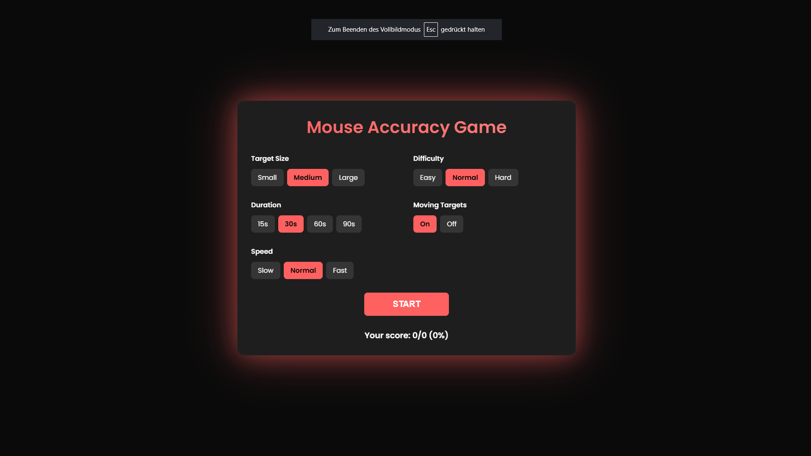
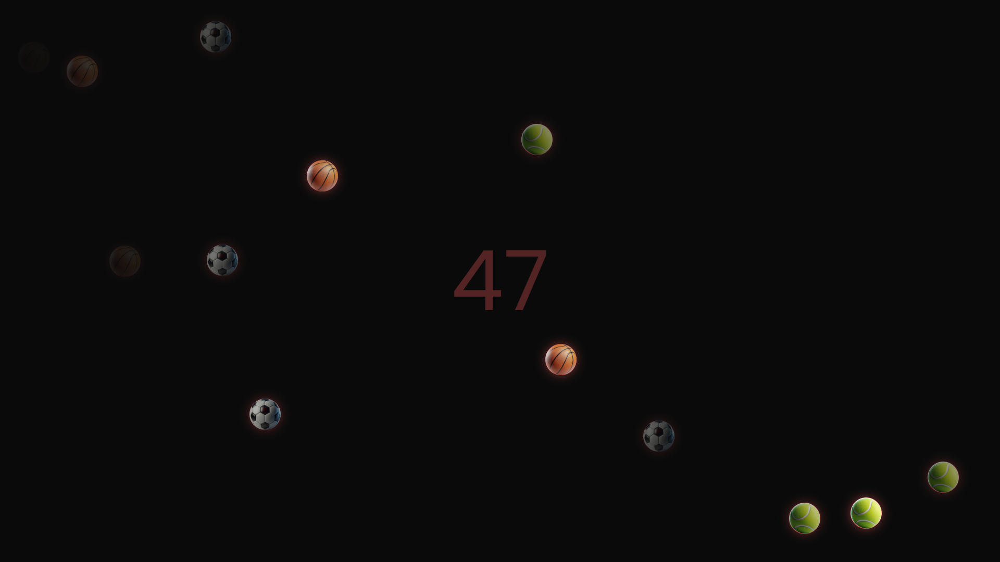

# Mouse Accuracy Game

## 🚀 Live-Demo  
👉 [https://ilias-mayer.github.io/Mouse-Accuracy-Game/](https://ilias-mayer.github.io/Mouse-Accuracy-Game/)

## 📝 Beschreibung
Dieses Spiel testet deine Präzision mit der Maus. Klicke auf sich bewegende oder statische Ziele innerhalb einer bestimmten Zeit, um deine Treffsicherheit zu verbessern. Verschiedene Einstellungen ermöglichen es, die Schwierigkeit individuell anzupassen.

## 🌐 Landing-Page

## 🎮 Game

## 🌟 Features
- 🎯 Anpassbare Zielgröße
- 📈 Verschiedene Schwierigkeitsstufen
- ⏱️ Einstellbare Spielzeit
- 🏃 Bewegliche oder statische Ziele
- ⚡ Unterschiedliche Geschwindigkeiten
- 🎵 Soundeffekte und Hintergrundmusik
- 📊 Score-Board

## 💡 Tipp: So änderst du die Bilder
1. Gehe in den `images`-Ordner.
2. Ersetze die vorhandenen Bilder (`x.png`, `y.png`, `z.png`) mit neuen Bildern deiner Wahl.
3. Achte darauf, dass die neuen Bilder denselben Namen haben wie die alten.
4. Falls du andere Namen nutzen möchtest, öffne die Datei `script.js`.
5. Ändere die Bildpfade in der `imagePaths`-Liste (wenn du mehr als die aktuelle Anzahl an Bildern haben willst, dann füge in diesem Format `, "images/BILDNAME.png"` hinzu).
6. Speichere die Änderungen und lade die Seite neu.
